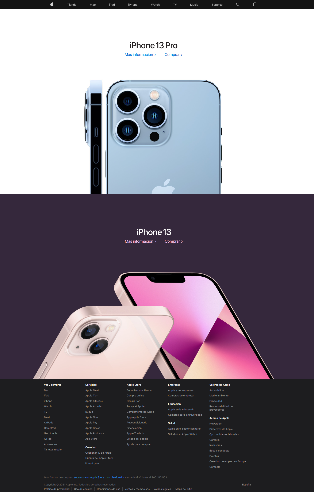
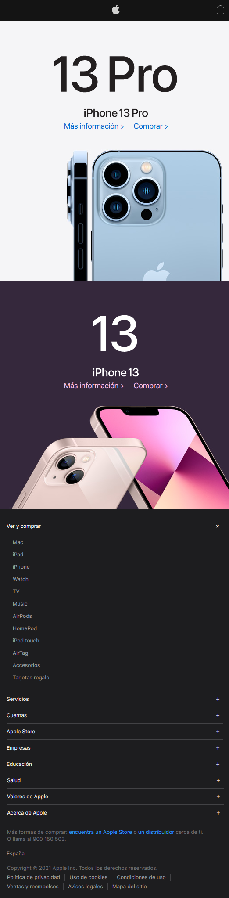

# Apple

Ya hecho el HTML, edita el archivo style.css para crear un layout como el de la imagen:

Tienes las imágenes necesarias en la carpeta img

El resultado final debe funcionar correctamente ejecutándolo con live server y no dar ningún error en el [Validador de CSS de la W3](https://jigsaw.w3.org/css-validator/#validate_by_input)
